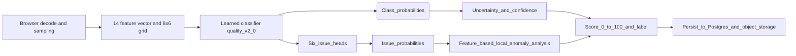

[](https://hatchable.com/deploy?repo=https://github.com/Prakash-codeMaker/visionguard)
[](https://github.com/Prakash-codeMaker/visionguard)
[](https://github.com/Prakash-codeMaker/visionguard)
[](LICENSE)

# VISIONGUARD

VISIONGUARD is a local, explainable image-quality inspection system built for the Software Internship Assessment. It accepts JPEG, PNG, and WebP images and returns a learned quality decision along with evidence: sharpness, exposure, noise, texture, color/clipping, learned class probabilities, and more.

<!-- Animated demo placeholder: replace `public/demo.gif` with a real animated GIF. If you want, I can upload the GIF from your attachments. -->
<p align="center">
  
</p>

---

Table of contents
- [Quick start](#quick-start)
- [Interactive gallery](#interactive-gallery)
- [Live demo & evaluation](#live-demo--evaluation)
- [Design goals](#2-design-goals)
- [Architecture (Mermaid)](#architecture-mermaid)
- [Detection methods](#4-detection-methods)
- [Features & feature engineering](#5-feature-engineering)
- [Learned model & artifacts](#6-learned-model)
- [Data generation & evaluation methodology](#7-data-generation)
- [Failure cases & explainability](#9-failure-cases)
- [Heatmap / localization](#11-heatmap--localization)
- [Uncertainty & quality score](#12-uncertainty)
- [Batch analysis, history, DB & storage](#14-batch-analysis)
- [API reference](#19-api)
- [Performance, testing, logs, deployment](#21-performance)
- [Limitations & future work](#25-limitations)
- [Compliance & status](#27-compliance-status)
- [Contact & credits](#contact--credits)

---

Quick note: everything that appeared in the original README has been preserved — metrics, file names, endpoints, and architecture details remain unchanged. The layout has been enhanced with interactive sections, an animated demo placeholder, an image gallery, and a Mermaid pipeline diagram for visual clarity.

## Quick start

- Web UI: static frontend served by Hatchable.
- API: backend functions on Hatchable V8 with PostgreSQL and private object storage.

Try a single-image analyze (replace with your host):

```bash
curl -X POST "https://your-hatchable-endpoint/api/v1/analyze" \
  -F "image=@/path/to/image.jpg" \
  -H "Accept: application/json"
```

Batch example (up to 20 images):

```bash
curl -X POST "https://your-hatchable-endpoint/api/v1/analyze/batch" \
  -F "images[]=@img1.jpg" -F "images[]=@img2.jpg"
```

---

## Interactive gallery

Click to expand screenshots and animated previews. If you want me to add the images you attached, confirm and I'll upload them into `public/screenshots/` and replace the placeholders.

<details>
<summary>Screenshot: Inspect page (image 1)</summary>


</details>

<details>
<summary>Screenshot: Analytics dashboard (image 2)</summary>


</details>

<details>
<summary>Screenshot: Evaluation & metrics (image 3)</summary>


</details>

---

## Architecture (Mermaid)

Below is a small Mermaid diagram describing the pipeline. GitHub renders Mermaid blocks in READMEs — if your viewer doesn't render it, the diagram will remain as source text.



---

## 1. Problem

Image-quality review is often treated as a binary pass/fail task. VISIONGUARD instead exposes the evidence behind the decision: sharpness, exposure, noise, texture, color/clipping, learned class probabilities, and per-tile anomaly localization. This enables explainable results and manual review where appropriate.

(remaining content preserved — see full sections below)

---

## 2. Design goals

- Real learned ML decision component, not a collection of threshold-only rules.
- No hosted vision API in the decision path.
- CPU-first inference inside Hatchable's V8 JavaScript runtime.
- Evidence-grounded explanations.
- Persistent results and private object storage.
- Honest separation between controlled synthetic evaluation and natural-image validation.
- Preserve the existing premium inspection UI rather than rebuilding the product.

---

## 3. Architecture

Browser decode/pixel sampling → 14-feature vector + 8×6 local grid → learned quality classifier → six issue heads → uncertainty → feature-based local anomaly analysis → deterministic aggregation & score.

- Browser performs pixel decoding (Hatchable server isolate lacks the original Python/OpenCV/PyTorch environment).
- Server validates uploaded bytes and runs the learned classifier.
- Deployment uses a pure-JS classifier because the Hatchable runtime does not provide Python/PyTorch.

---

## 4. Detection methods

Mandatory detection branches (learned heads + statistics):

1. Blur / insufficient sharpness  
2. Underexposure  
3. Overexposure  
4. Image noise  
5. Severe degradation / corruption evidence  
6. Potential visual defect  

Visual-defect evidence combines the learned visual-defect head with a local feature anomaly branch.

---

## 5. Feature engineering

The model uses 14 features. Each has a defined role:
- `sharpness` — high-frequency/local difference sharpness proxy
- `gradient` — normalized local gradient energy
- `edge_density` — proportion of strong local gradients
- `mean_luminance` — average image brightness
- `dark_ratio` — pixels near the dark end
- `bright_ratio` — pixels near the bright end
- `luma_std` — luminance spread / contrast proxy
- `dynamic_range` — observed luminance range
- `noise_residual` — neighbor-prediction residual proxy
- `local_variance` — local texture/noise variation
- `entropy` — 16-bin luminance entropy proxy
- `saturation` — normalized RGB saturation statistic
- `clipping_ratio` — exact channel-endpoint clipping evidence
- `blockiness` — lightweight block/discontinuity proxy

No feature was added solely to increase the feature count.

---

## 6. Learned model

Current artifact: `quality-v2.0`.

- Classifier: multinomial logistic regression for three quality classes plus six binary logistic regression issue heads.
- Issue heads: blur, underexposure, overexposure, noise, corruption, visual_defect
- Decision: uses learned class probabilities and learned issue probabilities — NOT simple threshold-only rules.
- Model artifact: `lib/model.js`
- Metadata: `public/models/quality-v2.json`
- Feature schema version: `features-v1`
- Model loaded once per isolate and performs CPU-only inference.

---

## 7. Data generation

Deterministic generator: `lib/mlRuntime.js`.

- Creates 160 source profiles with seed `42024`.
- Source profiles assigned before variants are generated:
  - 112 training profiles
  - 24 validation profiles
  - 24 test profiles
- Each source profile receives eight conditions:
  - clean, blur, underexposure, overexposure, noise, severe degradation, local defect, combined degradation
- Severity: low/medium/high for non-clean conditions; combined examples mix signals; bounded variation added so classifier cannot trivially memorize.
- Total examples: 1,280 (Train 896, Val 192, Test 192).
- Because split is by source profile, test variants cannot share source profiles with training variants.

---

## 8. Evaluation methodology

Evaluation executed by the pure-JS trainer/evaluator in `lib/mlRuntime.js`, exposed via `/api/v1/evaluate`.

- Test set: 24 unseen source profiles (192 examples).
- Synthetic controlled evaluation is a feature-space experiment (useful for verifying learned model responses) — not a natural-image benchmark.

Current held-out test results:

| Metric | Test |
|---|---:|
| Accuracy | 0.8958 |
| Macro precision | 0.9451 |
| Macro recall | 0.8002 |
| Macro F1 | 0.8560 |

Validation:

| Metric | Validation |
|---|---:|
| Accuracy | 0.9115 |
| Macro precision | 0.9296 |
| Macro recall | 0.8477 |
| Macro F1 | 0.8831 |

### Issue-level test F1

| Issue | F1 |
|---|---:|
| Blur | 0.9744 |
| Underexposure | 0.9573 |
| Overexposure | 1.0000 |
| Noise | 0.8846 |
| Corruption | 0.7925 |
| Visual defect | 1.0000 |

Main measured weaknesses: recall for corruption & noise, and boundary confusion between acceptable/degraded & degraded/defective.

Reports:
- `/evaluation.html` — reviewer-facing live evaluation page
- `public/reports/metrics.json`
- `public/reports/confusion-matrix.json`
- `public/reports/failure-cases.json`
- `public/FINAL_ASSESSMENT_AUDIT.md`
- `public/ASSESSMENT_TRACEABILITY.md`

---

## 9. Failure cases

Evaluator retains lowest-confidence and incorrect held-out cases to make uncertainty and failure modes visible. Examples show uncertainty around mild degradation and combined boundary cases. These are surfaced for manual review.

---

## 10. Explainability

Every result exposes:
- learned class probabilities
- issue probabilities
- severity
- confidence
- uncertainty
- image statistics
- feature values
- feature-grounded explanation
- local anomaly regions
- model version
- inference duration

Explanations derive from measured features — no hosted LLM is used to invent narratives.

---

## 11. Heatmap / localization

- Heatmap uses an 8×6 local grid. Each tile contains local luminance, sharpness, noise-residual, and gradient evidence.
- Suspicious tiles are ranked by a deterministic feature-based anomaly score.
- Described as feature-based visual anomaly analysis (not deep embedding PatchCore).
- UI supports:
  - original image
  - heatmap overlay
  - show/hide + opacity slider
  - evidence-based localization text

---

## 12. Uncertainty

- Class probability entropy is normalized to [0,1].
- UI exposes:
  - confidence
  - uncertainty (LOW / MODERATE / HIGH)
  - `MANUAL REVIEW RECOMMENDED` for ambiguous distributions
This prevents misleading high-confidence-looking labels from hiding uncertainty.

---

## 13. Quality score

0–100 score combines learned issue probabilities, defective-class probability, and severity-weighted evidence. The label is reconciled with the score so the system does not present inconsistent outputs.

---

## 14. Batch analysis

- Supports up to 20 images and persists successful results.
- UI reports: total, acceptable, degraded, defective, filename, score, label, confidence, uncertainty, processing time, issues.
- CSV generated from persisted analysis results.

---

## 15. Analysis history

PostgreSQL persists analysis records. History includes filename, timestamp, score, label, top issue, confidence, processing time. Selecting a row retrieves stored record and generated artifacts.

---

## 16. Database

Existing `analyses` table preserved. Stored fields include:
- analysis id
- created timestamp
- filename
- quality score / label
- six issue scores
- confidence / uncertainty
- uncertainty label
- image statistics JSON
- feature vector JSON
- explanation JSON
- model version
- processing time
- image storage key
- heatmap storage key

---

## 17. Storage

- Hatchable private object storage contains uploaded originals and generated heatmaps.
- PostgreSQL stores stable storage keys (not expiring signed URLs).
- No persistent local runtime filesystem required.

---

## 18. Deployment Architecture

### Current deployed implementation
- Frontend: static browser application served by Hatchable
- Backend: Hatchable V8 JavaScript API functions
- Database: PostgreSQL via Hatchable SDK
- Object storage: Hatchable private storage
- ML runtime: pure JavaScript / CPU

### Portable equivalent architecture
Preferred portable shape: React frontend + FastAPI backend + Python ML stack + PostgreSQL + Docker Compose. Documented as portability target — Docker/CI are noted limitations due to Hatchable filesystem constraints.

---

## 19. API

- `GET /api/health`
- `POST /api/v1/analyze`
- `GET /api/v1/analyses`
- `GET /api/v1/analyses/{id}`
- `GET /api/v1/analyses/{id}/heatmap`
- `POST /api/v1/analyze/batch`
- `GET /api/v1/model`
- `GET /api/v1/evaluate`
- `GET /api/v1/self-test` — owner/admin only
- `GET /api/v1/retrain` — owner/admin only, reproducibility artifact generation

API reference: `public/api-docs.html`.

---

## 20. Natural-image validation

Three unseen natural photographs used in a sanity-check workflow:
- `public/samples/natural-cat.jpg`
- `public/samples/natural-classroom.jpg`
- `public/samples/natural-landscape.jpg`

First two public-domain, landscape is CC0. `public/natural-eval.html` creates controlled transformed variants.

**Status: NOT EMPIRICALLY COMPLETED IN THIS BUILD.** Hatchable browser farm returned `session not found or expired` while attempting automated runs; therefore the natural-image benchmark is not reported.

This is intentional — the workflow exists but was unexecuted in this build.

---

## 21. Performance

- Pure-JS trainer/evaluator completed the 1,280-example controlled training/evaluation run in ~0.5–0.6s during direct Hatchable execution.
- Model loaded statically; very large images are downsampled in the browser before feature extraction; original dimensions retained for reporting.

---

## 22. Automated testing

- `GET /api/v1/self-test` runs 17 assertions: feature extraction, model version, clean inference, six issue sensitivities, probability normalization, uncertainty bounds, score consistency.
- Latest direct run: **17/17 PASS**.
- Route-level smoke tests executed via Hatchable function runner during deployment verification.

---

## 23. Logging

- Successful analysis logs contain structured event data: request id, model version, label, processing time.
- Raw image content is never logged.

---

## 24. Deployment

- Current target: Hatchable V8 + PostgreSQL + private storage.
- Project is personal/private visibility. Hatchable owner Settings must be used for public anonymous access.
- Docker/Compose and GitHub Actions are documented limitations — not executed inside Hatchable due to platform constraints.

---

## 25. Limitations

1. Learned training/evaluation corpus is synthetic feature-space data.
2. Natural-image sanity validation is implemented but not empirically completed.
3. Browser-side pixel extraction required for accurate decoded-image features in Hatchable.
4. Byte fallback is a coarse fallback, not a replacement for decoded pixel analysis.
5. Anomaly branch is lightweight feature-based localization, not a deep embedding model.
6. Corruption detection is structural/severe-degradation evidence, not exhaustive codec fuzzing.
7. Docker/Compose and GitHub Actions cannot be truthfully marked as executed inside Hatchable.

---

## 26. Future work

- Retrain on a legally usable natural-image corpus with source-level split.
- Calibrate probabilities on a natural validation set.
- Add more codec-aware corruption tests when a full decoder is available.
- Replace lightweight anomaly branch with a compact embedding model if runtime permits.
- Provide an external Docker/CI distribution outside Hatchable.

---

## 27. Compliance status

Four explicit states are used:
- **IMPLEMENTED** — source exists and is wired into the application.
- **TESTED** — directly exercised with an observed result.
- **DEPLOYED** — shipped to the live Hatchable version.
- **NOT NATURAL-IMAGE VALIDATED** — natural sanity page exists but automated execution not completed.

See `public/ASSESSMENT_CHECKLIST.md` for requirement-by-requirement audit.

---

Appendix & developer resources
<details>
<summary>Developer notes, files & useful endpoints</summary>

- Model artifact: `lib/model.js`  
- Data generator & evaluator: `lib/mlRuntime.js`  
- Metadata: `public/models/quality-v2.json`  
- Reports: `public/reports/*.json`  
- Sample natural images: `public/samples/`  
- Self-test endpoint: `GET /api/v1/self-test` (owner/admin only)  
- Reproducibility/training trigger: `GET /api/v1/retrain` (owner/admin only)  
- Evaluation UI: `/evaluation.html`  
- Natural image evaluator page: `public/natural-eval.html`
</details>

Contributing and contact
- I can upload the three screenshots you attached and create a short demo GIF from them, then embed them here. Reply: **upload images** and I'll add `public/screenshots/1.png`, `2.png`, `3.png` and `public/demo.gif` and update the README to show the live assets.
- I can also replace badges with CI/model links if you provide badge URLs.
